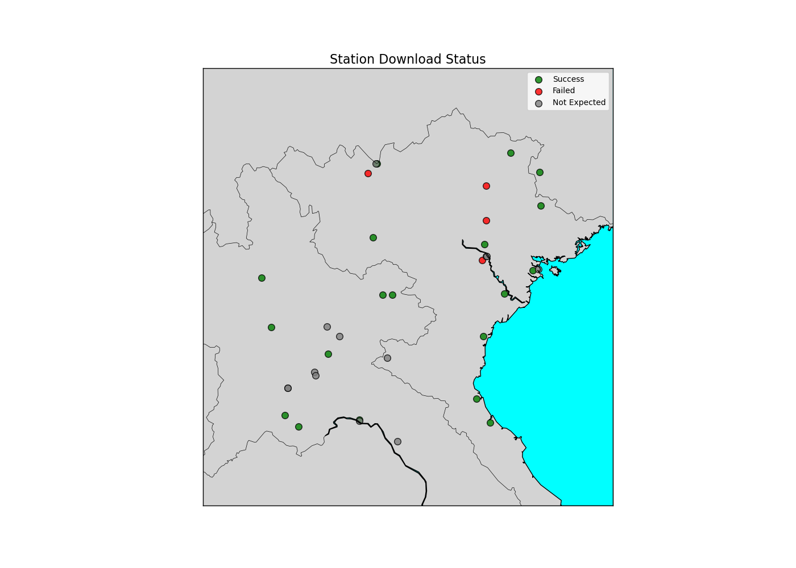

# This is script to download and proccess NCEI-GSD observation data


## Author
Quang-Van Doan
* Center for Computational Sciences
* University of Tsukuba, Japan
* Email: doan.van.gb@u.tsukuba.ac.jp
* GitHub: github.com/AtmosSciTools


## Description
A Python library for downloading and processing Global Summary of the Day (GSD) data from NCEI-NOAA.

> Copyright (c) 2024 Quang-Van Doan
>
> Permission is hereby granted, free of charge, to any person obtaining a copy of this software 
and associated documentation files (the "Software"), to deal in the Software without restriction, 
including without limitation the rights to use, copy, modify, merge, publish, distribute, sublicense, 
and/or sell copies of the Software, and to permit persons to whom the Software is furnished to do so, 
subject to the following conditions:
>
>The above copyright notice and this permission notice shall be included in all copies or substantial 
portions of the Software.
> 
> THE SOFTWARE IS PROVIDED "AS IS", WITHOUT WARRANTY OF ANY KIND, EXPRESS OR IMPLIED, INCLUDING BUT NOT 
LIMITED TO THE WARRANTIES OF MERCHANTABILITY, FITNESS FOR A PARTICULAR PURPOSE AND NONINFRINGEMENT. 
IN NO EVENT SHALL THE AUTHORS OR COPYRIGHT HOLDERS BE LIABLE FOR ANY CLAIM, DAMAGES OR OTHER LIABILITY, 
WHETHER IN AN ACTION OF CONTRACT, TORT OR OTHERWISE, ARISING FROM, OUT OF OR IN CONNECTION WITH THE 
SOFTWARE OR THE USE OR OTHER DEALINGS IN THE SOFTWARE.


## Installation

Here's a **step-by-step manual** to install and use the [`nceigsd_datatools`](https://github.com/AtmosSciTools/nceigsd_datatools/tree/main) repository from GitHub on your **local machine**:

## MInstall `nceigsd_datatools` Locally

### 1. Check Prerequisites

Make sure you have the following installed:

* **Python 3.7+**
* **pip** (Python package manager)
* **git** (version control)

To check, run in terminal:

```bash
python --version
pip --version
git --version
```

If missing:

* Install Python: [https://www.python.org/downloads/](https://www.python.org/downloads/)
* Install Git: [https://git-scm.com/downloads](https://git-scm.com/downloads)


### 2. **Clone the Repository**

Use `git` to clone the repository to your computer:

```bash
git clone https://github.com/AtmosSciTools/nceigsd_datatools.git
```

This will create a folder named `nceigsd_datatools`.


### 3. Navigate to the Project Directory

```bash
cd nceigsd_datatools
```


### 4. Install the Package

```bash
pip install .
```

### 5. Usage


```python
from nceigsd import NCEIGSDProcessor

processor = NCEIGSDProcessor(
    start_year=2010,         # start year
    end_year=2012,           # end year
    area=[18, 23, 102, 107], # lat1, lat2, lon1, lon2
    output_dir="output/test_output"  # download directory
)

processor.download_data()                    # Run data download and processing
processor.plot_station_locations() # Plot station locations with categories
processor.plot_availability_heatmaps()  # Plot heatmaps (if seaborn is available)
```

> check test/test.ipynb

Test downloaded results 




